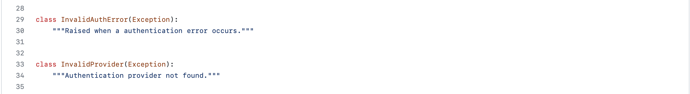
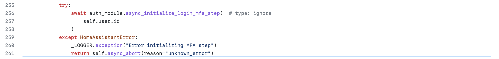
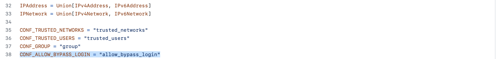
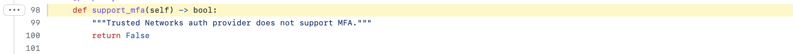
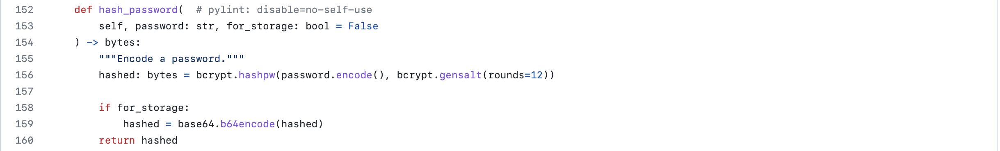
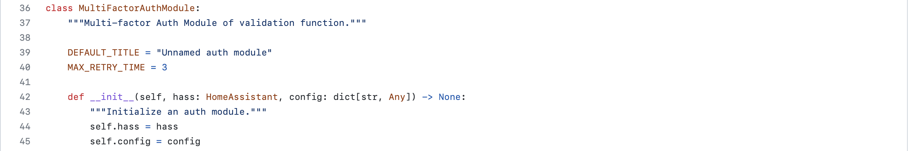

# Code Review Analysis

## Code Review Strategy
Without much familiarity of CWEs, they’re a vast pool of information with which we are not familiar. Manual code review is the most daunting, as it’s hard to determine where to start due to the volume of files and code. Additionally, our team is very limited in knowledge of Python, which is the primary language used by Home Assistant. Our strategy consisted of scoping in the security weaknesses identified in our threat models, assurance claims, and misuse cases identified earlier in the semester. We identified CWEs that would be most important for these processes. This turned out to be a bit of an iterative process: as we identified CWEs and reviewed the code, we found that there were other CWEs that appeared relevant and that CWEs previously identified, were possibly not as applicable. Ultimately, we were able to review approximately one to five files for each CWE. Our strategy adjusted as we went through the process. Originally, we planned to identify a few CWEs for each of the primary processes reviewed in the threat modeling assignment: authentication, IoT devices, and add-ons. However, it became clear that several of the CWEs applied to multiple processes. Therefore the strategy changed to review those processes but not to evaluate a CWE for only one particular process as it could apply to many of those three. Only one automated tool appeared to be fairly useful for Python code, SonarCloud. We also determined that Snyk might be useful. However, we did not put much emphasis on the results of the automated tool as it returned many results that did not appear to be critical security issues. Results can be found in the "**[Findings from Automated Code Review](#findings-from-automated-code-review)**" section.

## Findings from Manual Code Review

The code for authentication is well structured. Comments and docstrings are used to explain the code. Looking at the auth_store.py file, creating the new user, adding credentials, removing user, updating credentials, activating, and deactivating users is done properly. Proper use of async, assert, and await keywords is done. Using these keywords helps program to be synchronous and waits for the other callback function to complete its existing loop thus, avoiding the inconsistency in the storage. Exception handling in auth_store.py could have been used for each function. For example, Exception handling for creating new user can be added. Though, exception handling for providing wrong group id is implemented. Removing the user is done by pop operation on the user id but other credentials should also be removed. 
Looking at the _init_.py which is used to provide an authentication layer for Home Assistant. Exception handling is used in necessary parts. Classes for invalid authentication error and invalid provider are left blank without any body. These classes could have included the count for the invalid authentication from same Ip address so that, multiple log-in attempts from same Ip could be banned. 

#### [CWE-287](https://cwe.mitre.org/data/definitions/287.html)
In providers, _init_.py the authentication provider functions and multifactor authentication provider function are defined. CWE-287 – improper authentication cannot be valid. As authentication is done properly. In CWE-287, remembering the cookies for the credentials is the problem, but in this code no cookies where remembered and also multifactor authentication is used. Exception handling for these functions is also implemented.

#### [CWE-291](https://cwe.mitre.org/data/definitions/291.html)
Reliance on IP Address for Authentication can be a valid CWE for Home Assistant. Home Assistant relies on the trusted network IP addresses to bypass the log-in without any credentials. As per CWE-291, relying on the IP address to bypass the log-in can be harmful. Ip addresses can easily be spoofed. At least the multifactor authentication should be implemented while allowing trusted networks to bypass the log-in. Code for trusted network is found under providers folder, trusted_network.py. 

 

Changing the return value to True can enable the multifactor authentication for trusted network. 

#### [CWE-916](https://cwe.mitre.org/data/definitions/916.html)
Use of Password Hash with Insufficient Computational Effort. The CWE-916 specifies that using password hash function with insufficient computational effort can be harmful as many hash functions execute quickly with minimal overhead. CWE-916 suggests few hash functions that should be used such as bcrypt, scrypt, and PBKDF2 because they are all stronger than using salts with hash functions with very little computing overhead. 
Home Assistant uses one of the suggested hash functions by the CWE-916 that is bcrypt.

The code for this is found in Homeassistant.py file which provides authentication. 

#### [CWE-308](https://cwe.mitre.org/data/definitions/308.html)
Use of Single-factor Authentication. According to CWE-308, single-factor authentication can lead to unnecessary risk. Home assistant uses multifactor authentication which minimizes this risk. Home assistant provides max three trails for mfa. 

Code for this can be found at Core/homeassistant/auth/mfa_modules/_init_.py

#### [CWE-778](https://cwe.mitre.org/data/definitions/778.html)
According to an article at [opensource.com](https://github.com/home-assistant/core/blob/dev/homeassistant/components/logger/__init__.py), the logging function has many benefits including, but not limited to, separating _what_ is accomplished from just exactly _how_ it is accomplished. In our [Design](https://github.com/megharris/cyberockit/blob/main/Designing_for_SSE.md) project, we explained that the Microsoft Threat Modeling Tool identified a number of threats that were mitigated by establishing a logging or audit function. Home Assistant has the Logger integration which seems to address these issues. Due to the importance of keeping a log for so many reasons, we determined that [CWE 778: Insufficient Logging](https://cwe.mitre.org/data/definitions/778.html) was important to evaluate for Home Assistant, and really any other software. HA's [logger webpage](https://www.home-assistant.io/integrations/logger/) takes us to the code that is used to invoke this feature. We reviewed the [init file](https://github.com/home-assistant/core/blob/dev/homeassistant/components/logger/__init__.py) and found that it is actually invoking the Python Logging module in line 2, which is powerful, thread-safe and meets the needs of various types of users, individual and enterprise. 

#### [CWE-307](https://cwe.mitre.org/data/definitions/307.html)
The HTTP integration of HA is implemented in all active installations. This integration includes an IP ban and a threshold for failed login attempts. This can be found in the [ban.py](https://github.com/home-assistant/core/blob/dev/homeassistant/components/http/ban.py) file. The file also notes that the user-agent is unsanitized which could certainly create vulnerabilities for SQL injection and XSS. However, the user-agent data is only included in the log, preventing these issues. No significant findings for this file/CWE.

#### [CWE-1173](https://cwe.mitre.org/data/definitions/1173.html)
This CWE covers [improper use of the validation framework](https://cwe.mitre.org/data/definitions/1173.html). This CWE is more applicable than the regular user input CWE 20 since in the use of IoT devices, the process usually does not involve the input of information by the user, but rather communication and input by the devices themselves. Due to this, in communication with the IoT devices, proper validation needs to occur for all inputs. Python generally does a good job of providing necessary validation frameworks for data. The example below was found in [core/homeassistant/components/__init__.py](https://github.com/home-assistant/core/blob/dev/homeassistant/components/__init__.py). When connecting with IoT device components, input validation is most likely occuring at an appropriate level here in the case of bracketed entity_id and domain, with Python handling validation of inputs. 

#### [CWE-707](https://cwe.mitre.org/data/definitions/707.html)
Improper neutralization is applicable in home assistant in the case of the below message, turning text data to a proper URL with slugify. The CWE for improper neutralization can be found [here](https://cwe.mitre.org/data/definitions/707.html). In the case of slugify it is neutralizing the input text into a new slug value before passing it on, and it also checks for None or an empty string showing proper validation. This code was found in [core/homeassistant/util/__init__.py](https://github.com/home-assistant/core/blob/dev/homeassistant/util/__init__.py).

#### [CWE-297](https://cwe.mitre.org/data/definitions/297.html)
This CWE covers improper validation of certificate with host mismatch and can be found [here](https://cwe.mitre.org/data/definitions/297.html). Home Assistant must communicate with a host but if its name mismatches with the certificate it provides that becomes an issue. Here an issue was found in the context of the auto review and included in this section about CWEs.

#### [CWE-20](https://cwe.mitre.org/data/definitions/20.html)

In Supervisor/addon/addon.py [CWE- 319 – Cleartext transmission of Sensitive Information](https://cwe.mitre.org/data/definitions/319.html) is not a valid case as sensitive information (login credentials in this case) are not transmitted from supervisor to the add-on. Instead, a token is checked validity, for an add-on to start. The token is issued when supervisor is logged into by the user or by a service. This stops the credentials from needing to be entered in add-ons which may or may not be validated by the add-on store. Since the credentials only need to be entered in Supervisor, they are not transmitted over the network. The token is changed for each instance that Supervisor is logged in or an application is requested to start up.  

#### [CWE-319](https://cwe.mitre.org/data/definitions/319.html)

#### [CWE-312](https://cwe.mitre.org/data/definitions/312.html)

Sensitive information that HA and Supervisor system uses are most of the time, the information for authenticating, validating and specifying a particular user of the HA system over the network. The current code review documents that all the sensitive information transferred in addon.py and auth.py for authentication has not been stored as clear text. They used random tokens for user sessions which are used for identification over the network and passwords were encrypted during storage while authenticating.

The image from [auth_store.py](https://github.com/home-assistant/core/blob/dev/homeassistant/auth/auth_store.py) line 211 to 299 shows refresh and authorization tokens to be used so that sensitive information is not required after users has access to the system in order to use other web features for accessing the add-on store. Tokens are used rather than the actual user information. 

The user data is stored as private in the data dictionary.

#### [CWE-311](https://cwe.mitre.org/data/definitions/311.html)

Encryption is one of the most used protection for data in a system. We looked for sensitive data flows in the system and their storage. User data and passwords used in HA were all found to have proper encryption where necessary. In command line interface the password is popped after certification. 

The password verification and storage is done with encryption as seen from [homeassistant.py](https://github.com/home-assistant/core/blob/dev/homeassistant/auth/providers/homeassistant.py) for authorization.

## Findings from Automated Code Review
Sonarcloud was a useful automated code review tool that allowed a static analysis of the github codebase. Sonarcloud works well with Python as well which was imperative since Home Assistant is almost completely written in Python. Some of the highlights seen from the code review of the core repository were in using a stronger SSL/TLS protocol. The instance in the code can be seen here. This issue was found in multiple files and in multiple contexts within Home Assistant.

Given that Home Assistant is using a protocol generally deemed secure, these issues were not followed up on.

Additionally, in analysis of the HA core, one of the IoT component sets available with Home Assistant revealed an issue with server hostname verification on the SSL/TLS connection. Both instances occured in the [core/homeassistant/components/mikrotik/hub.py](https://github.com/home-assistant/core/blob/dev/homeassistant/components/mikrotik/hub.py). 

The issue here is that the hostname verification should be set to True. Analysis of the core on sonarcloud can be found [here](https://sonarcloud.io/project/overview?id=nzetun_hacore).

The static analysis of Home Assistant Supervisor revealed two secure mode and padding scheme issues. Analysis of the HA Supervisor can be found [here](https://sonarcloud.io/project/overview?id=nzetun_cyberockit).

## Summary of Key Findings

## OSS Project Pull Requests, Issues, Discussions
The lead developers at Home Assistant take a very active role in the open-source community. This includes monthly blog updates, software bug fixes and code revisions. Community involvement in open-source software development is highly celebrated by the Home Assistant team, and the lead developers actively participate in the community engagement. Recently a hack-a-thon called Hacktoberfest was held as a way of celebrating open-source software and people contributing to open-source software (especially Home Assistant) in which many different changes to Home Assistant were made by volunteer developers. There is also the upcoming annual Home Assistant State-of-the-Union, where the lead developers for Home Assistant share their vision and plans for the next year, along with new features that they have been working on over the last year. Issues are readily dispersed to the responsible parties with the issue board available on github and anyone with an issue with their Home Assistant instance can reach out. Interestingly security revisions and issues are not available publicly on github. The Home Assistant developers maintain all security issues privately and respond directly to any security issues.

## Reflection and Collaboration
Our reflection for this project is very similar to those previously completed this semester. The project appeared straight-forward at first glance and our team very easily divided the work to get a good start on it. However, as often happens, one team member was out of town, another became ill, and third had an urgent personal matter to attend to. Our timeline had to change quite a bit. However, also as usual, our team is very effective in adjusting to a new plan on the fly. We stayed in communication about our problems, continued to ask each other for clarification and guidance, and re-evaluated the division of work multiple times. Ultimately, we did the "ID CWEs" step almost three times as we became more familiar with them and their hierarchy and application to our OSS. At one point, we were concerned that our team just did not have the knowledge to complete a manual code review of the Python code files. As a result, we reviewed previously submitted projects to get an idea for the way that other teams approached their code analysis. This gave us comfort that we were on the right track and after getting feedback from Dr. Gandhi, we were able to put our manual code review into action. Even during manual code review, we had to work with each other quite often to confirm that our understanding of the code was accurate and that our findings were reasonable. The team completed a daunting task and collaborated extermely effectively. We all believe we would be happy to work together again in the future, if some of our members were not graduating soon.
